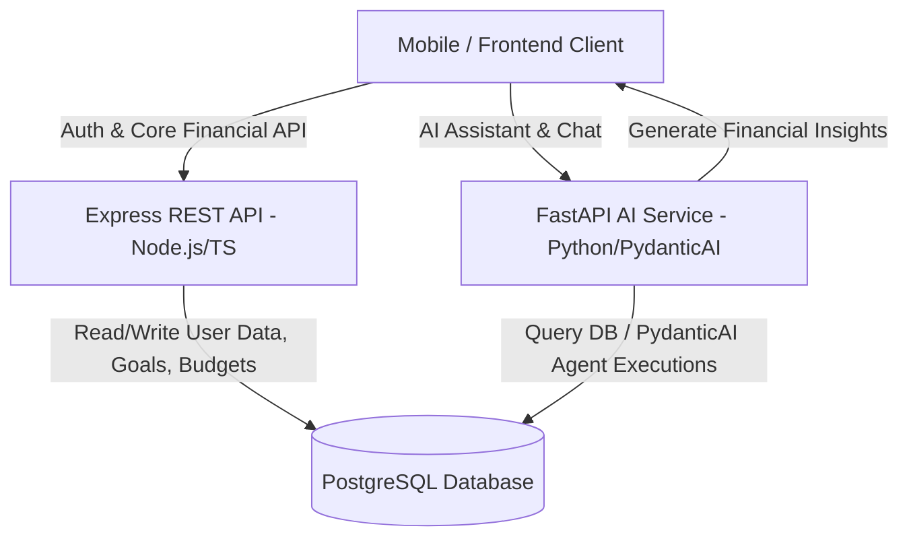

# Finia Backend - System Architecture & Design

## System Overview

Finia is an AI-powered personal finance platform backend. The backend architecture is split into two microservices:

1. **REST API Microservice (`server/api/src`)**
   - **Role**: Primary business logic, user management, authentication, core financial goals, budgeting.
   - **Tech Stack**: Node.js, Express, TypeScript, Prisma ORM, PostgreSQL.
   - **Authentication**: JWT Access & Refresh Tokens.

2. **AI Microservice (`server/ai/src`)**
   - **Role**: AI Financial Assistant, chat agent, automated financial plan generation, budget insights & nudges.
   - **Tech Stack**: Python 3.12+, FastAPI, Pydantic v2, PydanticAI, Async SQLAlchemy, PostgreSQL.
   - **AI Framework**: PydanticAI structured agents with system prompts and tool integrations.

---

## Database Schemas & Models

### Express API (Prisma Schema - `server/api/src/prisma/schema.prisma`)

- **User (`users`)**:
  - `id`: UUID (Primary Key)
  - `email`, `password`, `name`, `role` (USER | ADMIN)
  - Financial Profile: `income`, `spendMostly`, `spendMostlyOn`, `motive`, `currency`
  - Settings: `theme`, `notifications`, `biometric`, `twoFactor`, `aiNudges`
  - Relations: `goals`, `budgets`, `tokens`

- **Goal (`Goal`)**:
  - `id`: UUID
  - `userId`: Foreign Key -> User
  - `goalName`, `goalType` (`EMERGENCY_FUND`, `VACATION`, `CAR`, `HOME`, `GADGET`, `EDUCATION`, `INVESTMENT`, `CUSTOM`)
  - `targetAmount`, `currentSavedAmount`, `targetDate`, `projectedCompletionDate`
  - `status`: `ACTIVE` | `COMPLETED` | `ARCHIVED`
  - `smartSaverEnabled`: Boolean
  - `createdVia`: `MANUAL` | `AI_PLAN`

- **Budget (`budgets`)**:
  - `id`: UUID
  - `userId`: Foreign Key -> User
  - `category`: String (Unique per user)
  - `amount`, `limit`: Float

- **Token (`tokens`)**:
  - `id`, `token`, `userId`, `type` (`ACCESS` | `REFRESH` | `RESET_PASSWORD` | `VERIFY_EMAIL`), `expires`, `blacklisted`

---

### Python AI Service (SQLAlchemy Models - `server/ai/src/backend/app/db/models`)

- **Agent Sessions & Conversations**: Tracks user multi-turn conversations with AI assistant.
- **Message Log & Vector Storage**: Stores prompt history, function execution results, and user financial context.

---

## Communication & Flow

---

## Key Design Principles

1. **Decoupled Architecture**: Financial data management and heavy AI LLM processing run as independent services to isolate compute overhead and scale independently.
2. **Type Safety**: TypeScript on the REST API and Pydantic v2 schemas on the FastAPI service guarantee strict contract enforcement.
3. **Repository Pattern**: Both services isolate raw database queries into data repositories (`services/` in Node, `repositories/` in FastAPI).
4. **Structured AI Outputs**: PydanticAI is used to ensure all LLM responses conform to expected JSON schemas (e.g., structured savings advice, AI goal plan steps).
